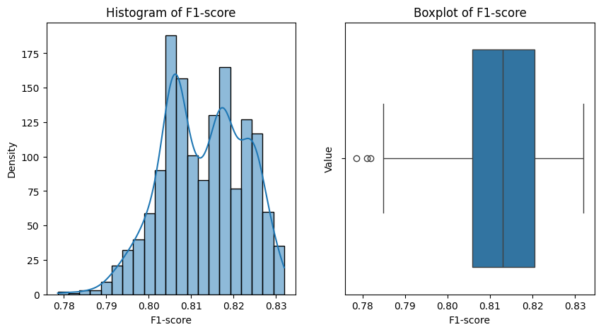
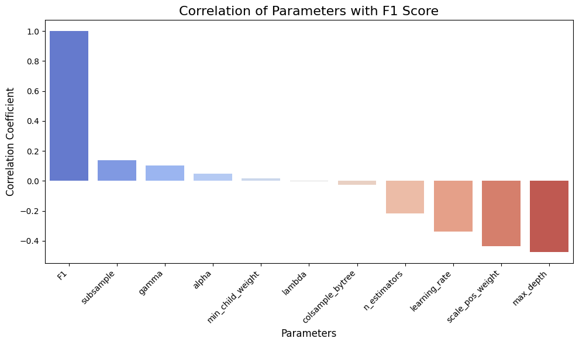
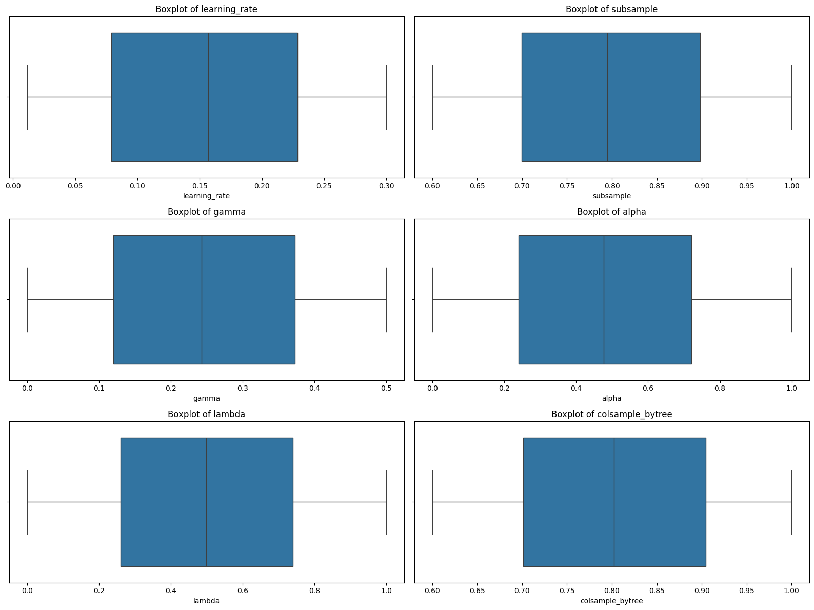
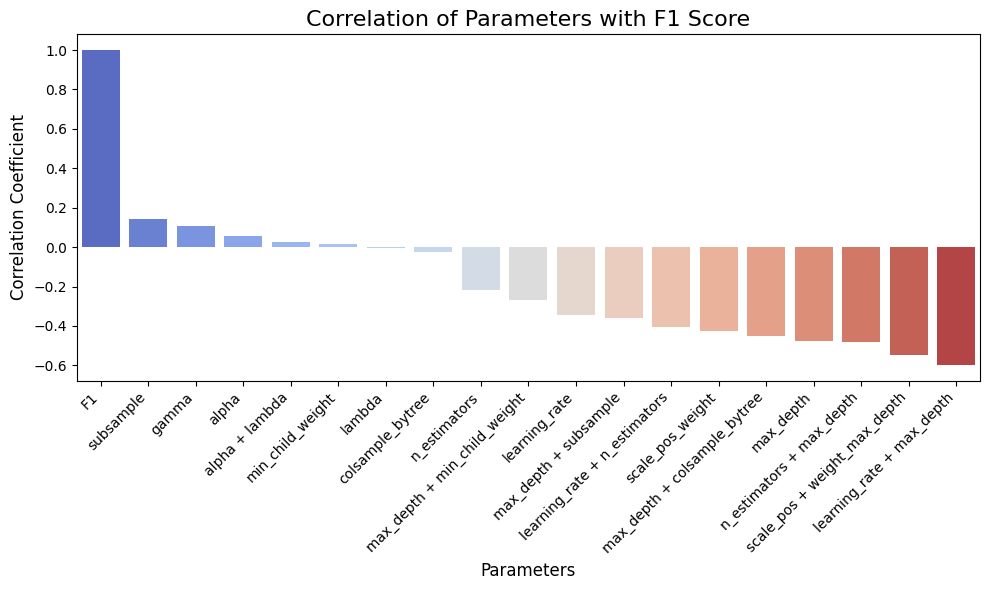
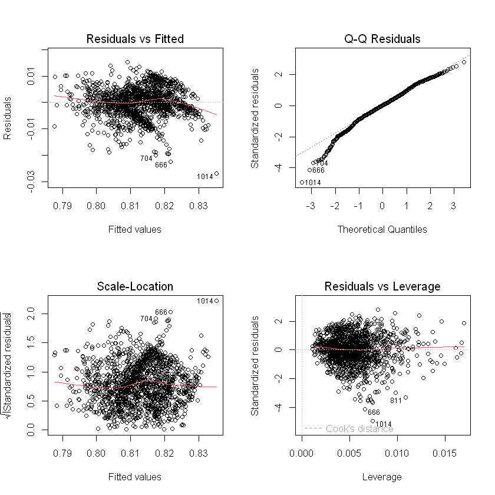
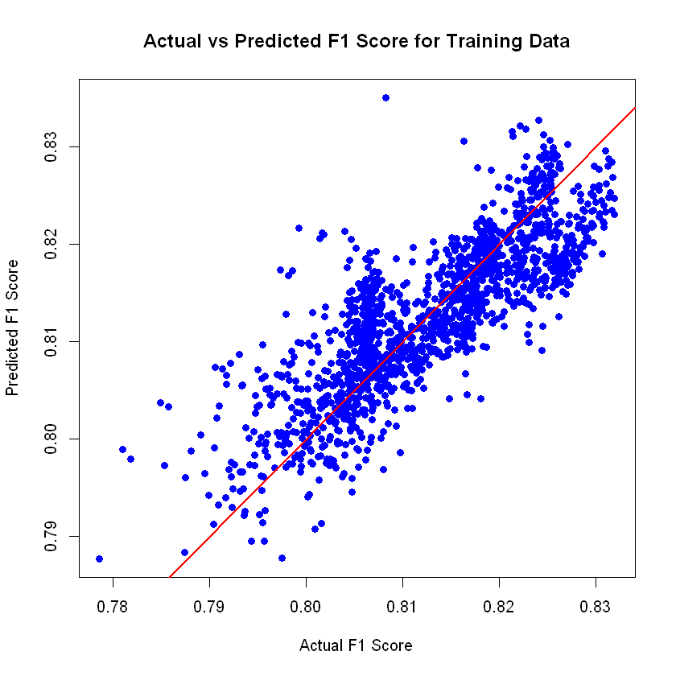
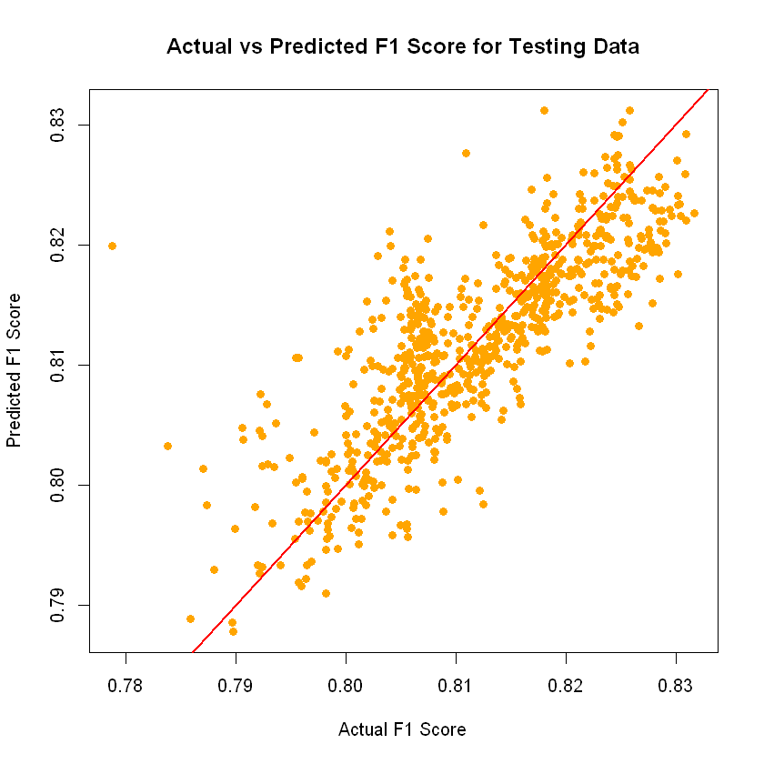

# Hyperparameters Effects on XGBoost Model
111062233 余承祐

## Introduction

In this report, the goal is to explore the effects of hyperparameters on the XGBoost model. We will train an XGBoost model with different hyperparameters and compare the performance of the models. We will also build a regression model to see which of the hyperparameters are more important for the model performance.

## Motivation

Choosing the right hyperparameters is an important part of building a model. They control the behaviors of the model and can significantly affect the performance. I want to take a look at the effects of hyperparameters on the XGBoost model and understand the role of each hyperparameter in the model's performance.

## Data Preparation

Given a training set and testing set, I generate 1500 sets of hyperparameters in random while also ensure that the values are reasonable. Each set of hyperparameters will be used to train an XGBoost model and evaluate its performance on the testing set, the criteria for evaluating the performance is *F1-score*, which is the target label in our data.

The data contains 1500 rows and 11 columns, representing 10 hyperparameters and the F1-score, include:

- Continuous: 
    - `learning_rate`: the learning rate of the gradient descent algorithm.
    - `subsample`: the fraction of samples to be used for fitting the individual trees.
    - `colsample_bytree`: the fraction of features to be used for fitting the individual trees.
    - `gamma`: the minimum loss reduction required to make a further partition on a leaf node of the tree.
    - `reg_alpha`: L1 regularization term on weights.
    - `reg_lambda`: L2 regularization term on weights.
    - `F1`: the F1-score of the model on the testing set.
- Discrete: 
    - `n_estimators`: the number of trees in the forest.
    - `max_depth`: the maximum depth of each tree.
    - `min_child_weight`: the minimum sum of instance weight (hessian) needed in a child.
    - `scale_pos_weight`: control the balance of positive and negative weights. 

## Exploratory Data Analysis

In this section, I will explore the data to see if there are any patterns or correlations between the hyperparameters and F1-score. First, let's see the distribution of F1-score.

### Distribution of F1-score

The distribution of F1-score is shown in the figure below. The values range from 0.78 to 0.83, with a median of 0.81. It's right skewed, which means most of the values are larger than 0.8. There are some outliers shown in the boxplot, but I decide to ignore them since it's a small portion of the data and not affect the overall distribution.

*(Figure 1. Distribution of F1-score)*

### Correlation between Hyperparameters and F1-score

Here I will use a bar plot to show the correlation between the hyperparameters and F1-score. The x-axis represents the hyperparameters, and the y-axis represents the correlation. You can see that most of the hyperparameters have a negative correlation with F1-score.
> For example, `learning_rate` has a negative correlation with F1-score, which means the higher the learning rate, the model will learn faster but not precisely.

*(Figure 2. Correlation between Hyperparameters and F1-score)*

### Outliers

For the other 6 continuous features, I will use boxplot to show the distribution of the values. We can see that there is no outlier in the data.

*(Figure 3. Boxplot of Continuous Hyperparameters)*

### Interactions between Hyperparameters

Here I will just list some of the interactions according to the domain knowledge. All of these will be included to the data for regresion model.
- `learning_rate * n_estimators`
- `learning_rate * max_depth`
- `n_estimators * max_depth`
- `max_depth * subsample`
- `alpha * lambda`
- `max_depth * min_child_weight`
- `scale_pos_weight * max_depth`
- `max_depth * colsample_bytree`

> For example, a model with large `n_estimators` often needs a smaller `learning_rate` to prevent overfitting.

We can check the correlations again. It looks like most of the interactions have a higher negative correlation with F1-score.

*(Figure 4. Correlation with F1-score after adding interactions)*

## Regression Model
In this section, I will build a stepwise regression model to see which of the hyperparameters are more important for the model performance.

### Stepwise Regression & Collinearity Check

We perform a stepwise regression in both forward and backward directions to find the most important hyperparameters. After the selection, I remove some of the features which have the higher p-value than the threshold of 0.001. Finally, I check the collinearity between the selected features using the VIF (Variance Inflation Factor) method. 

The result of the model is shown in the table below.

| Hyperparameter | Estimate Coef. | VIF |
| :--- | ---:| --- |
| (Intercept) | 8.237e-01 |  |
| subsample | 2.022e-02 | 1.41 |
| gamma | 5.900e-03 | 1.00 |
| learning_rate + n_estimators | 8.366e-06 | 5.71 |
| learning_rate + max_depth | -8.875e-03 | 4.60 |
| scale_pos_weight | -3.958e-03 | 1.00 | 
| max_depth + subsample | -1.264e-03 | 2.51 |
| n_estimators | -9.522e-06 | 3.07 |

*(Table 1. Regression Model Result)*

The F-statistic of the model is 460.9 on 7 with the degree of freedom 1492, which tells that it's very significant.

### Model Diagnosis

From the diagnosis plots of the data, we can see that
- **Normality**: Q-Q plot shows some deviation from normality, especially the tails, it's probably due to the outliers. However, it's not severe and acceptable.
- **Mean model**: the residual seems to be scattered around zero in Residual vs Fitted plot randomly, which appears to met.
- **Equal variance**: from the Scale-Location plot, we can see that the red line is close to horizontal, which means the equal variance assumption is met.
- **Outliers**: some points are identified as outliers, but they are not severe and I decide to ignore them.

*(Figure 5. Diagnosis Plots)*

## Model Evaluation

Here I've generated another data (750 rows) as the testing set. We may find that the model can predict the F1-score well on the unknown data, too. The plots show the predicted F1-score compared with the actual F1-score, red line is a reference line for actual F1-score.

- Training data:

*(Figure 6. Training Data Prediction)*

- Testing data:

*(Figure 7. Testing Data Prediction)*

The table shows the metrics of the model performance:
| Metric | Multiple R-squared | Adjusted R-squared | Training Data | Testing Data |
| --- |:---:|:---:|:---:|:---:|
| R-squared | 0.6838 | 0.6823 | 0.6840 | 0.6657 |
| Mean Absolute Error (MAE) |  |  | 0.0042 | 0.0041 |

> Due to the small range of F1-score, MAE will be better to evaluate the model performance rather than MSE.

*(Table 2. Model Performance Metrics)*

## Discussion : XGBoost in Reality

In this report, we find that hyperparameters such as `subsample`, `gamma`, `scale_pos_weight` and `n_estimators` are included in the model. Also, we find that the interactions between hyperparameters such as `learning_rate` and `max_depth` play an important role in the model performance. In addition, the model does quite well.

In reality, most of these hyperparameters are widely used in XGBoost models. In this case, 
* `learning_rate` controls the step size of the learning algorithm.
* `n_estimators` and `max_depth` control the complexity of the model. 
* `gamma` and `subsample` control the shrinkage of the model to prevent overfitting.
* `scale_pos_weight` controls the balance of positive and negative weights.

However, there are actually a lot of hyperparameters in XGBoost, and we only selected a few of them for this report. In practice, the combinations and effects of hyperparameters can be more complex and requires more experimentation. Another possible challenge is to generalize the results to other datasets and models.

## Conclusion

In this report, we generate our own data, explored the effects of hyperparameters on the XGBoost model and built a regression model to see which of the hyperparameters are more important for the model performance. 

Choosing the right hyperparameters is indeed an important aspect of building an XGBoost model. By exploring the effects of hyperparameters, we can have a better understanding of the model's performance and make better decisions in the future.

## Citation

This report is based on the following sources:

- [XGBoost Documentation](https://xgboost.readthedocs.io/en/stable/parameter.html)
- [STAT-analysis](https://github.com/omei-ogami/STAT-analysis): you can find all the code and data in my Github.

AI has been used to generate some of the figures in this report.